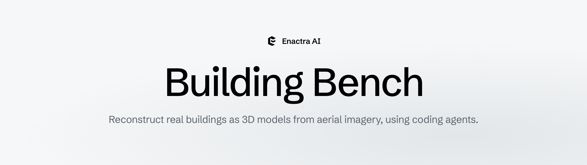
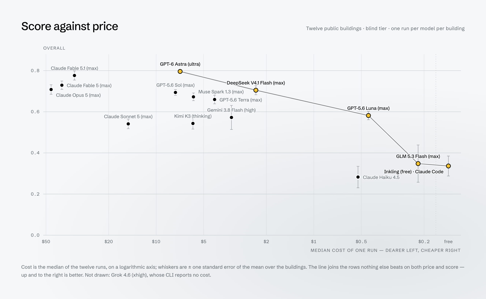
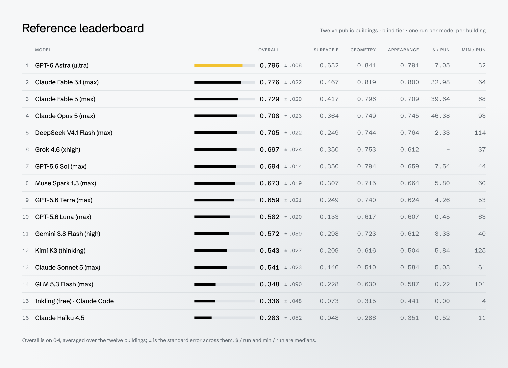
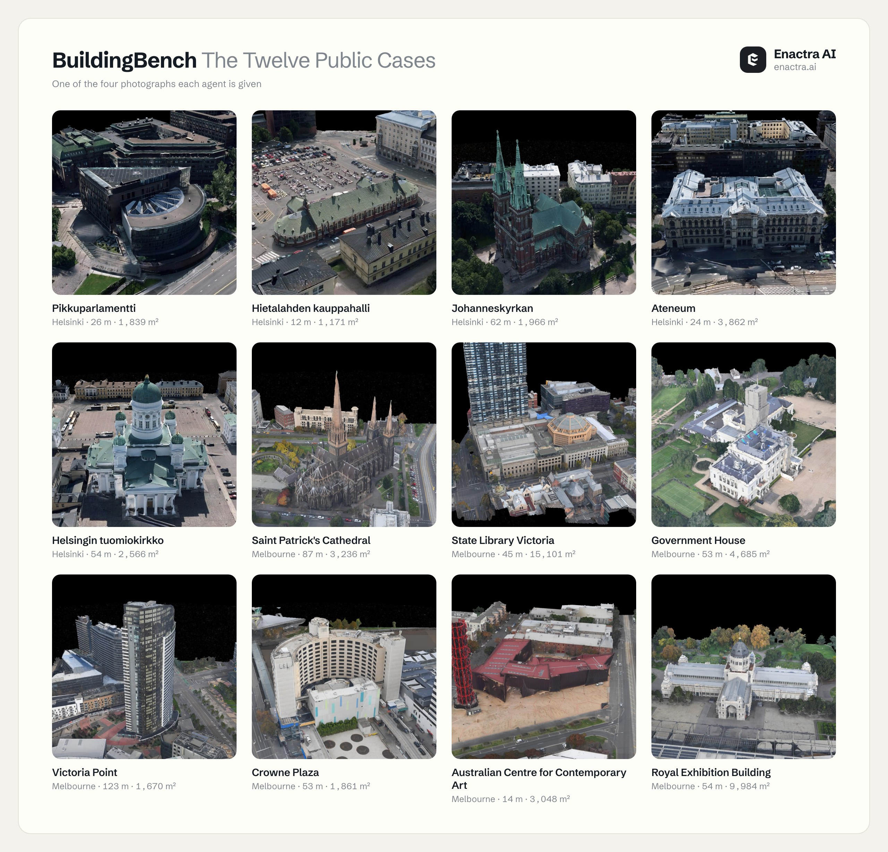

<p align="center">
  <picture>
    <source media="(prefers-color-scheme: dark)" srcset="docs/assets/header-dark.png">
    
  </picture>
</p>

<p align="center">
  <a href="#the-leaderboard">Leaderboard</a> &nbsp;·&nbsp;
  <a href="#the-twelve-cases">Cases</a> &nbsp;·&nbsp;
  <a href="#the-task">Task</a> &nbsp;·&nbsp;
  <a href="#quick-start">Quick start</a> &nbsp;·&nbsp;
  <a href="#reproducibility">Reproducibility</a>
</p>

<p align="center">
  <a href="LICENSE"></a>
  <a href="DATA_LICENSE.md"></a>
  <a href="pyproject.toml"></a>
</p>

An agent is put in a folder holding four photographs of a building, the exact
pose and lens of each camera, and a one-page task. It hands back a single
binary glTF, and we measure it against the real building.

This repository is the open part of the benchmark:

- `cases/` — **12 cases**: five buildings from the Helsinki 3D city model and
  seven from the City of Melbourne 2020 photomesh, both released under CC BY 4.0.
- `bench/` — **the agent's kit**: what the lane's `./check` and `./preview`
  are built on.
- `harness/`, `docker/` — **the harness** we run agents with: the same working
  directory, container, prompt and command line.
- `results/` — **our reference runs** on these 12 cases: 189 runs, scored by
  our grader.

The grader is not part of this release, and the leaderboard we report is
computed over a larger set of buildings that we keep private. To have
submissions scored, or an agent evaluated on the full set, see
[Full leaderboard](#full-leaderboard).

## The leaderboard

Sixteen models, one run per model per building, on the twelve public cases at
the **blind** tier — the agent is told neither the footprint nor the height.

<p align="center">
  <picture>
    <source media="(prefers-color-scheme: dark)" srcset="docs/assets/price-dark.png">
    
  </picture>
</p>

Price buys very little of this benchmark. The three dearest rows — Claude
Fable 5.1, Claude Fable 5 and Claude Opus 5, at \$33 to \$46 a run — are all
beaten by GPT-6 Astra at \$7.05, and DeepSeek V4.1 Flash matches Claude Opus 5
for a twentieth of its price. Every point below the line is beaten by something
cheaper. What separates the top of the board from the bottom is not
spend.

<p align="center">
  <picture>
    <source media="(prefers-color-scheme: dark)" srcset="docs/assets/leaderboard-dark.png">
    
  </picture>
</p>

<details>
<summary><b>The same board as text</b> — reproduce it with <code>python -m harness.board --ranked</code></summary>

| # | Model | Overall | ± SE | Surface F | Geometry | Appearance | $ / run | min / run |
|---:|---|---:|---:|---:|---:|---:|---:|---:|
| 1 | GPT-6 Astra (ultra) | 0.796 | 0.008 | 0.632 | 0.841 | 0.791 | 7.05 | 32 |
| 2 | Claude Fable 5.1 (max) | 0.776 | 0.022 | 0.467 | 0.819 | 0.800 | 32.98 | 64 |
| 3 | Claude Fable 5 (max) | 0.729 | 0.020 | 0.417 | 0.796 | 0.709 | 39.64 | 68 |
| 4 | Claude Opus 5 (max) | 0.708 | 0.023 | 0.364 | 0.749 | 0.745 | 46.38 | 93 |
| 5 | DeepSeek V4.1 Flash (max) | 0.705 | 0.022 | 0.249 | 0.744 | 0.764 | 2.33 | 114 |
| 6 | Grok 4.6 (xhigh) | 0.697 | 0.024 | 0.350 | 0.753 | 0.612 | – | 37 |
| 7 | GPT-5.6 Sol (max) | 0.694 | 0.014 | 0.350 | 0.794 | 0.659 | 7.54 | 44 |
| 8 | Muse Spark 1.3 (max) | 0.673 | 0.019 | 0.307 | 0.715 | 0.664 | 5.80 | 60 |
| 9 | GPT-5.6 Terra (max) | 0.659 | 0.021 | 0.249 | 0.740 | 0.624 | 4.26 | 53 |
| 10 | GPT-5.6 Luna (max) | 0.582 | 0.020 | 0.133 | 0.617 | 0.607 | 0.45 | 63 |
| 11 | Gemini 3.8 Flash (high) | 0.572 | 0.059 | 0.298 | 0.723 | 0.612 | 3.33 | 40 |
| 12 | Kimi K3 (thinking) | 0.543 | 0.027 | 0.209 | 0.616 | 0.504 | 5.84 | 125 |
| 13 | Claude Sonnet 5 (max) | 0.541 | 0.023 | 0.146 | 0.510 | 0.584 | 15.03 | 61 |
| 14 | GLM 5.3 Flash (max) | 0.348 | 0.090 | 0.228 | 0.630 | 0.587 | 0.22 | 101 |
| 15 | Inkling (free) · Claude Code | 0.336 | 0.048 | 0.073 | 0.315 | 0.441 | 0.00 | 4 |
| 16 | Claude Haiku 4.5 | 0.283 | 0.052 | 0.048 | 0.286 | 0.351 | 0.52 | 11 |

</details>

How the board is computed: one run per model per building. A model's score is
the mean over the twelve buildings and `± SE` is the standard error across
them; a model appears only once it has run all twelve, because a mean over a
different set of buildings is a different measurement. `$ / run` and
`min / run` are medians, and the cost is what the agent's CLI reported, except
where the CLI does not know it: Muse's reports nothing and is metered, and
Claude Code priced the DeepSeek row against its own first-party card, so that
row is the pinned endpoint's published rates on the CLI's own token counts,
which each run carries. For subscription logins it is the API-equivalent price,
except Grok Build's, which reports neither a price nor token counts: that row
has no cost and is not on the price plot. Its `min / run` is the agent's own
turn, from the CLI's log — the CLI keeps the lane open for some minutes after
the turn ends, uploading the session. Every run is in
`results/reference_runs.jsonl`; `python -m harness.board` leaves the `--ranked`
filter off and shows the partial rows too.

## The twelve cases

<p align="center">
  <picture>
    <source media="(prefers-color-scheme: dark)" srcset="docs/assets/cases-dark.jpg">
    
  </picture>
</p>

| Case | Building | City | Height | Footprint |
|---|---|---|---:|---:|
| `helsinki_cathedral` | Helsingin tuomiokirkko (Helsinki Cathedral) | Helsinki | 54.1 m | 2,566 m² |
| `helsinki_8033120` | Ateneum | Helsinki | 23.8 m | 3,862 m² |
| `helsinki_122954081` | Hietalahden kauppahalli (Hietalahti Market Hall) | Helsinki | 12.0 m | 1,171 m² |
| `helsinki_123901485` | Johanneskyrkan (St John's Church) | Helsinki | 62.4 m | 1,966 m² |
| `helsinki_122886734` | Pikkuparlamentti (Little Parliament) | Helsinki | 25.6 m | 1,839 m² |
| `melbourne_25422768` | Government House | Melbourne | 53.3 m | 4,685 m² |
| `melbourne_45461060` | Australian Centre for Contemporary Art | Melbourne | 13.9 m | 3,048 m² |
| `melbourne_33106429` | Crowne Plaza | Melbourne | 52.7 m | 1,861 m² |
| `melbourne_4817059` | Royal Exhibition Building | Melbourne | 54.4 m | 9,984 m² |
| `melbourne_155809136` | St Patrick's Cathedral | Melbourne | 86.7 m | 3,236 m² |
| `melbourne_22820458` | State Library Victoria | Melbourne | 45.0 m | 15,101 m² |
| `melbourne_296368687` | Victoria Point | Melbourne | 122.6 m | 1,670 m² |

Heights are the tallest point measured off the mesh. Each case is one folder:

```
cases/<case>/
  task.json          the task as data: cameras, budget, what is revealed (nothing: blind)
  agent/             everything the agent is given; this becomes its working directory
    TASK.md          the brief
    views/*.png      four photographs, 2304 x 1728
    cameras.json     pose and lens of each photograph
    site.json        the ground origin, and nothing else
  truth/             the answer key, never shown to the agent
    full/ colour/ alpha/ clean/    renders and masks from all eight cameras
    points/          the true surface, as point clouds
    reference.json   reference measurements of the true building
    site.json        the building's OpenStreetMap footprint (ODbL)
    ATTRIBUTION.txt  the dataset the photographs were rendered from
    measured.json  cameras.json  held_out.json  masks.json
```

## The task

The agent sees `agent/TASK.md` and the files beside it, two tools in its
working directory — `./check` (is the submission admissible?) and `./preview`
(draw the model's outline over each photograph) — and the kit they are built
on, importable as `bench.building` (`glb.write` produces a conforming file,
`raster.render` is the renderer `./preview` uses).

It hands in `submission/building.glb` — binary glTF 2.0, self-contained, in
metres, Y up, +X east, +Z south, origin at the footprint's centroid on the
ground — and `submission/manifest.json` saying how it was made: at most
300,000 triangles and 64 MB, no Draco, meshopt or KTX2.

The four photographs look down 28° from the four compass points. This is the
**blind** tier: the agent is told neither the footprint nor the height.

The agent has open network access and may look things up. It is not told which
dataset its photographs were rendered from.

## Quick start

Python 3.11 or newer.

```bash
git clone https://github.com/DeepWorld101/building-bench.git && cd building-bench
python -m venv .venv && . .venv/bin/activate
pip install -e '.[test]'
python -m harness.cases        # every case file matches cases/SHA256SUMS
pytest
```

**Run an agent the way we did.** Build the lane image once, then:

```bash
docker build -f docker/lane.Dockerfile -t building-bench-lane .

python -m harness.run --list                                    # the reference configurations
python -m harness.run --agent haiku --case melbourne_25422768   # Claude Code: ANTHROPIC_API_KEY or ~/.claude login
python -m harness.run --agent gpt-5.6-luna-max --all --codex-auth /path/to/auth.json
python -m harness.run --agent glm-5.3-flash-max --all           # opencode: OPENROUTER_API_KEY

# CLIs the image cannot redistribute: bring the binary, --tool puts it on the
# lane's PATH. Name the versioned `muse-bin-*`, not the shim that dispatches to it
python -m harness.run --agent musespark13max --all --tool muse=/path/to/muse-bin-*
python -m harness.run --agent gemini38flash --all --tool agy=/path/to/agy
# Grok Build: the binary at ~/.local/bin/grok (or GROK_BIN), signed in with
# `grok login --device-auth`; the lane gets that login file and nothing else
python -m harness.run --agent grok46xhigh --all

# anything else -- {prompt} is replaced by the opening prompt, quoted, and
# --tool and --env are how your CLI and its key reach the lane
python -m harness.run --command 'my-agent run {prompt}' --label my-agent --all \
    --tool my-agent=/path/to/my-agent --env MY_API_KEY

```

Each run leaves `runs/<run_id>/` — the agent's stdout and stderr, `run.json`,
and the submission it handed in — and a line in `runs/index.jsonl`; the agent's
lane stays under `lanes/` for inspection. This release does not score it: see
[Full leaderboard](#full-leaderboard). A run the provider refused (a rate
limit, a spent quota) is filed as such, with the CLI's own words, and never as
a result. Credentials reach the container as a mode-600 env file or a read-only
mount, never on the command line, and stopping `harness.run` stops the agent's
container with it.

## The reference setting

What every reference run had, and what `harness/` reproduces:

- each product's own CLI, headless, at the highest reasoning effort it offers,
  pinned on the command line: Claude Code 2.1.257–2.1.261, Codex CLI 0.153.0,
  opencode 1.15.12, kimi-cli 1.49.0, Antigravity (`agy`) for the Gemini rows,
  Meta's `muse` CLI for Muse Spark, through the meter in `harness/muse/`, and
  Grok Build 0.2.22 (`grok`) for Grok 4.6, where the level that reaches the
  model is set by `--reasoning-effort`, not `--effort`;
- a Docker container holding only the lane — the agent's working directory and
  its HOME — on the default bridge network, with open internet access, 8 GB of
  memory, 4 CPUs, no capabilities and at most 512 processes.
  `docker/lane.Dockerfile` rebuilds its image from public packages at the
  versions the reference runs had;
- **no time limit.** `task.json` states a 90-minute, 120-step budget; the
  reference runner did not enforce it, and `--minutes` defaults to none;
- opencode ends a turn whenever the model writes a message without a tool call,
  and kimi-cli ends one when a stream drops. For those two the harness resumes
  the same session — up to six and five times — with the note in
  `harness/agents.py`, for as long as there is no submission. It also puts
  opencode's model catalogue (models.dev) into the lane's HOME before the agent
  starts: in a fresh HOME opencode's first model lookup races the catalogue
  download and can fail with "Model not found".

## Reproducibility

- **The lane is the reference lane.** For every configuration in
  `harness/agents.py`, `lane_command` returns exactly the command the reference
  runner sent, `lane.prepare` builds exactly the working directory it built,
  and the container gets exactly its flags — each checked against the
  reference runner itself before release — with the differences in what the
  agent sees below.
- **The figures come from the data.** `docs/figures.py` draws everything on
  this page from `results/reference_runs.jsonl` and `cases/cases.json` through
  the same `harness.board`, so a figure cannot drift from the repository it
  illustrates.
- **Agents are not deterministic.** The same agent on the same building varies
  from run to run — on this benchmark a single run's overall typically moves by
  about 0.05. Differences between models smaller than their `± SE` are not an
  ordering.
- **What the agent sees has changed.** `TASK.md` used to name the dataset the
  photographs were rendered from, and `agent/` held an `ATTRIBUTION.txt`; it now
  says only that the photographs are renders of a photogrammetric mesh, and the
  attribution lives in `truth/`. `TASK.md` no longer describes how submissions
  are graded, the lane no longer has `./materials` (the opening prompt still
  names it, as it did for the reference runs), and the kit's modules no longer
  include grading code.

## Not in this release

- The grader, and with it the `./materials` tool; the code that builds cases
  from a 3D city model; and the Unreal Engine and three.js renderers we use for
  inspection.

## Full leaderboard

The twelve cases here are a public development set, answer keys included. The
leaderboard we report is computed over a larger set of buildings that we keep
private, with the same grader and the same lane, and the grader is not
released. To have submissions scored, or an agent evaluated on the full set,
write to **contact@enactra.ai** with the submissions or the command that runs
the agent (a `--command` line for `harness.run` is enough).

## Licence

Code: Apache License 2.0 — see `LICENSE`. Data: the
cases are derived from the Helsinki 3D city model (© City of Helsinki) and the
City of Melbourne 3D Textured Mesh (Photomesh) 2020 (© City of Melbourne),
both CC BY 4.0, and carry OpenStreetMap footprints (© OpenStreetMap
contributors, ODbL). See `DATA_LICENSE.md` for attribution, the changes made,
and what applies to which files.

<p align="center">
  <br>
  <a href="https://enactra.ai"><picture>
    <source media="(prefers-color-scheme: dark)" srcset="docs/assets/mark-dark.svg">
    
  </picture></a>
  <br><br>
  <sub><b>Building Bench</b> is a benchmark from <a href="https://enactra.ai">Enactra AI</a>.</sub>
</p>
